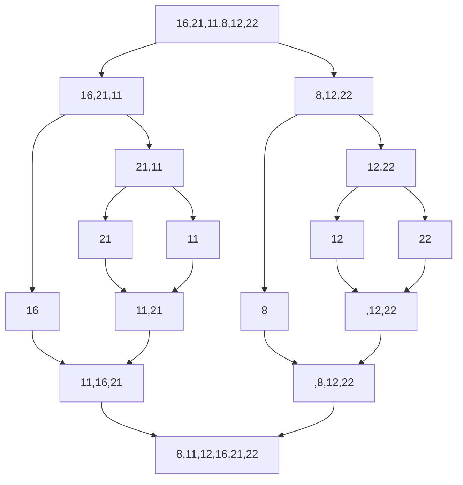

# Veri Yapıları ve Algoritmalar > Merge Sort Projesi

**[16,21,11,8,12,22]** -> Merge Sort

## Yukarıdaki dizinin Merge Sort türüne göre aşamları:



## Big-O gösterimi:

```brash
  -   O(nlogn)
```

* [Patika](https://app.patika.dev/paths)